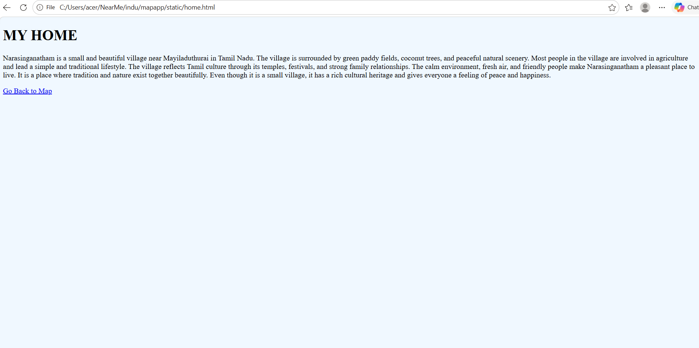
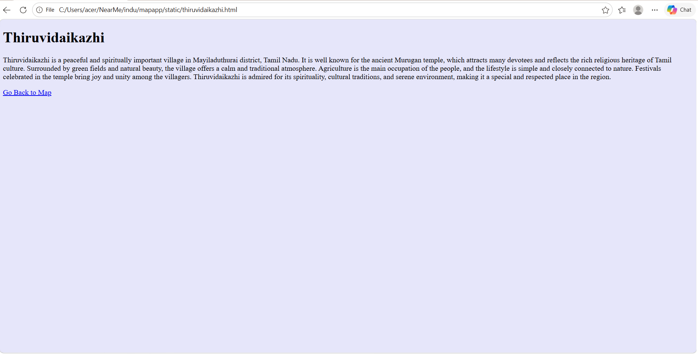
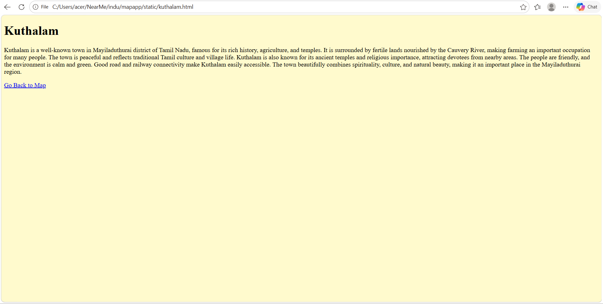

# Ex03 Places Around Me
## Date: 25.05.2026

## AIM
To develop a website to display details about the places around my house.

## DESIGN STEPS

### STEP 1
Create a Django admin interface.

### STEP 2
Download your city map from Google.

### STEP 3
Using ```<map>``` tag name the map.

### STEP 4
Create clickable regions in the image using ```<area>``` tag.

### STEP 5
Write HTML programs for all the regions identified.

### STEP 6
Execute the programs and publish them.

## CODE
map.html
```

<html>
<head>
<title>My City</title>
</head>
<body>
<h1 align="center">
<font color="red"><b>Mayiladuthurai</b></font>
</h1>
<h3 align="center">
<font color="blue"><b>Imesha.S(212225040131)</b></font>
</h3>
<center>


<map name="image-map">
    <area target="" alt="Narasinganatham" title="Narasinganatham" href="home.html" coords="1627,569,1414,622" shape="rect">
    <area target="" alt="Kuthalam" title="Kuthalam" href="kuthalam.html" coords="959,560,802,498" shape="rect">
    <area target="" alt="Thiruvidaikazhi" title="Thiruvidaikazhi" href="thiruvidaikazhi.html" coords="1861,666,1704,604" shape="rect">
    
</map>
</center>
</body>
</html>

```
home.html
```
<!DOCTYPE html>
<html>
<head>
    <title>Narasinganatham</title>
</head>

<body bgcolor="aliceblue">

    <h1>MY HOME</h1>

    <p>
        Narasinganatham is a small and beautiful village near Mayiladuthurai in Tamil Nadu.
        The village is surrounded by green paddy fields, coconut trees, and peaceful natural scenery. 
        Most people in the village are involved in agriculture and lead a simple and traditional lifestyle. 
        The village reflects Tamil culture through its temples, festivals, and strong family relationships. 
        The calm environment, fresh air, and friendly people make Narasinganatham a pleasant place to live.
        It is a place where tradition and nature exist together beautifully. Even though it is a small village, 
        it has a rich cultural heritage and gives everyone a feeling of peace and happiness.
    </p>

    <a href="/">Go Back to Map</a>

</body>
</html>

```
kuthalam.html
```

<!DOCTYPE html>
<html>
<head>
    <title>Kuthalam</title>
</head>

<body bgcolor="lemonchiffon">

    <h1>Kuthalam</h1>

    <p>
       Kuthalam is a well-known town in Mayiladuthurai district of Tamil Nadu, famous for its rich history, agriculture, and temples. 
       It is surrounded by fertile lands nourished by the Cauvery River, making farming an important occupation for many people. 
       The town is peaceful and reflects traditional Tamil culture and village life.
       Kuthalam is also known for its ancient temples and religious importance, attracting devotees from nearby areas.
       The people are friendly, and the environment is calm and green. Good road and railway connectivity make Kuthalam easily accessible. 
       The town beautifully combines spirituality, culture, and natural beauty, making it an important place in the Mayiladuthurai region.
    </p>

    <a href="/">Go Back to Map</a>

</body>
</html>

```
thiruvidaikazhi.html
```

<!DOCTYPE html>
<html>
<head>
    <title>Thiruvidaikazhi</title>
</head>

<body bgcolor="lavender">

    <h1>Thiruvidaikazhi</h1>

    <p>
        Thiruvidaikazhi is a peaceful and spiritually important village in Mayiladuthurai district, Tamil Nadu.
        It is well known for the ancient Murugan temple, which attracts many devotees and reflects
        the rich religious heritage of Tamil culture.
        Surrounded by green fields and natural beauty, the village offers a calm and traditional atmosphere.
        Agriculture is the main occupation of the people, and the lifestyle is simple and closely connected to nature.
        Festivals celebrated in the temple bring joy and unity among the villagers.
        Thiruvidaikazhi is admired for its spirituality, cultural traditions, and serene environment, making it a special and respected place in the region.
    </p>

    <a href="/">Go Back to Map</a>

</body>
</html>

```


# OUTPUT






## RESULT
The program for implementing image maps using HTML is executed successfully.
